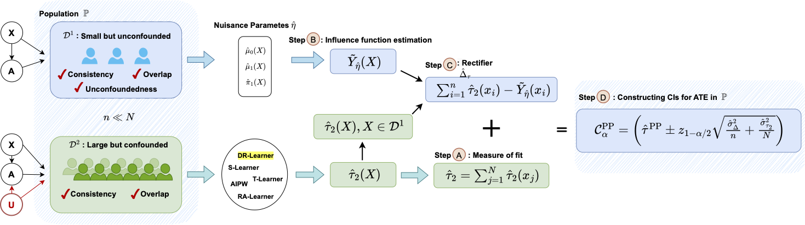

# Constructing Confidence Intervals for Average Treatment Effects from Multiple Datasets

### Abstract
Estimating confidence intervals (CIs) of the average treatment effects (ATE) from patient records is crucial to assess the effectiveness and safety of drugs. However, patient records typically come from different hospitals, thus raising the question of how multiple observational datasets can be effectively combined for this purpose. In our paper, we propose a new method that estimates the ATE from multiple observational datasets and provides valid CIs. Our method makes little assumptions about the observational datasets and is thus widely applicable in medical practice. The key idea of our method is that we leverage prediction-powered inferences and thereby essentially `shrink' the CIs so that we offer more precise uncertainty quantification as compared to naïve approaches. We further prove the unbiasedness of our method and the validity of our CIs. We confirm our theoretical results through various numerical experiments. Finally, we provide an extension of our method for constructing CIs from combinations of experimental and observational datasets. 

### Folder structure

Our python code are stored by different dataset in the folders, we take `rct_data` as an example:

1. `synthetic_data_generation`: script for generating datasets
2. `run_utils`: train models, create confidence intervals
3. `experiments_u/main`: run specific experiments and store results
4. `plot`: plot and summarize the results

